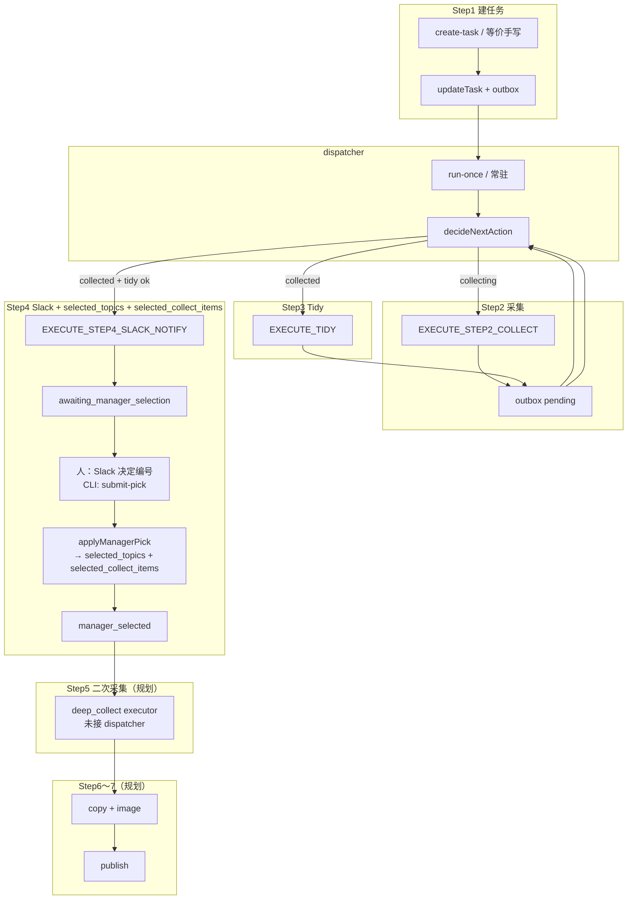

# Orchestrator 流程图：Step1～Step7（产品语义 + 代码对齐）

- **产品步骤总表**：`pipeline_steps_overview.md`
- **编排驱动**：`task.json` + SQLite `outbox_events` + `dispatcher`（**非** `approved/` publish 队列）

---

## 产品 Step ↔ 代码/产物（简表）

| 产品 Step | 代码/入口（当前） | 备注 |
|-----------|------------------|------|
| Step1 任务创建 | `create-task` → `updateTask` | 写 `task.json`、首条 outbox |
| Step2 话题采集 | `EXECUTE_STEP2_COLLECT` → `executeStep2Collect` | `collect_result` |
| Step3 话题整理 | `EXECUTE_TIDY` → `executeTidyFromCollect` | `topic_candidates.v1` |
| Step4 Slack + 选题文件 | `EXECUTE_STEP4_SLACK_NOTIFY` + **`submit-pick`** → `applyManagerPick` | 发帖在 dispatcher；固化为 CLI；含 **selected_collect_items** |
| Step5 二次采集 | *未接 dispatcher* | 见 `steps/step5_deep_collect.md` |
| Step6 文案+图片 | *未接 dispatcher* | 见 `steps/step6_generation.md` |
| Step7 发布 | `node/src/publish`（CLI）与编排 *待对接* | 见 `steps/step7_publish.md` |

---

## 流程图（Step1～Step4 已实现；Step5～7 为规划）

---

## 读图要点

1. **Step4** 在工程上拆成 **自动发帖** 与 **人工/CLI 固化选题** 两段，产品文档合并为一步。
2. **Step5～7** 状态机在 `transitionGuard.ts` 中已有迁移名，**executor 与 dispatcher 需后续接入**。
3. Step4 投递模式：`direct` / `role` / `dry_run`，见 `node/src/executors/step4RoleDispatch.ts`。

---

## 维护

步骤定义变更时同步：`pipeline_steps_overview.md`、`spec/steps/step*.md`、本文件。
