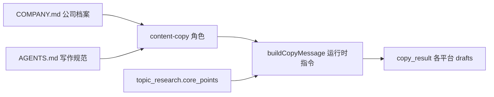

# content-copy 文案质量与公司宣传优化（功能规划）

> **状态**：规划中（未实施）  
> **角色**：`workspace-content-copy` · Step6 `content-copy`  
> **相关规范**：`step6_copy_image_spec.md`、`memo.md`  
> **代码入口**：`node/src/step6-generate/copyRoleDispatch.ts` → `buildCopyMessage()`

## 1. 背景与问题

当前 Step6 文案偏 **泛 IT 营销号**：口号多、标签墙、缺少可复述观点，也 **未自然带出公司业务**。

### 1.1 典型反例（现状）

小红书 / TikTok 等平台易出现：

```text
2026高考志愿填报：还在纠结电气、机械、医学还是计算机？🤖AI时代，传统专业正被科技重塑！
不再是单一学科的较量，而是技术融合的舞台。💡想知道AI、大数据、物联网如何赋能你的未来职业？
如何打破专业壁垒，规划高增长潜力职业赛道？关注我们，带你用科技视角看懂高考志愿新趋势，抢占未来高薪风口！
#高考志愿 #AI时代 #专业选择 …
```

日文 Facebook 稿亦类似：句式正确，但 **无实质分析、无公司视角**。

### 1.2 根因（对照代码与配置）

| 现象 | 根因 |
|------|------|
| 「AI 重塑一切」「抢占风口」「关注我们」 | 无 **品牌禁区** 与 **CTA 规范** |
| 无实质分析 | `topic_research.research.core_points` 已有洞察，但 `buildCopyMessage()` **未强制引用** |
| 不像公司宣传 | `workspace-content-copy/USER.md` 为空；全项目 **无公司简介/业务/受众** |
| 多语言同一套空话 | 仅约束语言与字数，无 **平台叙事结构** |

`copyRoleDispatch.ts` 中 instruction 仅写 `professional IT promo tone`，`AGENTS.md` 仅一句「IT 宣传、见 memo.md」——**memo.md 侧重调研流程，不是写稿规范**。

---

## 2. 优化目标

1. **更自然**：像资深顾问表达观点，而非营销号 slogans。
2. **有实质**：每篇至少 2 条可独立成立的洞察，来自 `research.core_points`（改写，非标签罗列）。
3. **贴合公司**：每篇 1 处软性业务植入（培训/服务/规划方法），不硬广。
4. **贴合 IT 行业**：把泛话题落到技能栈、岗位、产业应用，而非「AI 很火」。
5. **可迭代**：后续可加禁止词质检、输出审计字段。

**不在本次范围**：改 Step5 调研逻辑、改 Step7 发布、换模型。

---

## 3. 方案总览（三层加固）



| 层级 | 位置 | 作用 |
|------|------|------|
| 公司档案 | `workspace-content-copy/COMPANY.md` | 品牌、受众、植入方式、禁止用语 |
| 角色规范 | `SOUL.md` / `AGENTS.md` / `USER.md` | 人设、正文结构、反例 |
| 运行时 | `buildCopyMessage()` instruction 数组 | 强制引用 research + COMPANY 规则 |
| 可选质检 | `parseCopyRolePayload` / retry | 禁止词、hashtag 上限 |

---

## 4. 第一层：公司档案（P0，须人工填写）

新建 **`workspace-content-copy/COMPANY.md`**（模板如下，实施前由业务方填实）。

```markdown
## 我们是谁
- 公司/品牌名、主营业务（例：对日 IT 培训、留学就业、企业内训）
- 核心优势（师资、项目实战、对日就业通道、行业资源）

## 目标受众
- 留学生家长 / 应届生 / 转行开发者 / 企业 HR …

## 宣传立场（IT 行业）
- 代表观点（例：选专业看技术栈与产业，不追热搜专业名）
- 常挂钩话题：AI 工程化、云原生、对日外包、医疗信息化 …

## 语气
- 资深顾问口吻，非营销号
- 观点须与 research.core_points 可对齐

## 禁止用语（硬禁）
- 抢占风口、关注我、私信领取、绝密、100% guaranteed …
- 正文 hashtag 堆砌（建议正文内 # 不超过 3 个）
- research 未出现的具体录取率、薪资、市场份额

## 软性植入（每篇至少 1 处，自然即可）
- 例：「我们在对日 IT 课程里会专门讲 XX 技能树」
- 例：「选专业前，建议先做一次技术兴趣与岗位画像」
- 不要硬广；全文公司名出现不宜过多
```

`USER.md` 改为指向：`公司信息见 COMPANY.md`。

> **无 COMPANY.md，仅改 prompt 无法稳定产出「公司宣传」文案。**

---

## 5. 第二层：升级 content-copy 角色描述（P0）

### 5.1 `SOUL.md`（人设）

在现有「IT 技术宣传文案专家」基础上扩展，例如：

- 对日 / IT 教育品牌的 **资深内容顾问**（以 COMPANY.md 为准）
- **先观点、后关联业务**；宁可短而准，不要长而空
- 输出仍严格 JSON，服务自动化流水线

### 5.2 `AGENTS.md`（强制正文结构）

在现有平台/字数规则之外，增加 **逻辑顺序**（各平台按 `body` 上限裁剪）：

| 段落 | 内容 | 数据来源 |
|------|------|----------|
| ① 钩子 | 1 句真实场景/问题 | `title` |
| ② 洞察 | **≥2 条**可独立成立的观点 | `research.core_points`（须改写） |
| ③ IT/行业连接 | 具体技能/岗位/产业应用 | `keywords` / `articles` 方向 |
| ④ 公司视角 | **1 句**自然带出培训或服务价值 | `COMPANY.md` |
| ⑤ 收尾 | 开放式思考或克制 CTA | 禁用「关注我们」类口号 |

**反例写入 AGENTS.md**（见 §1.1）。

**正例方向**（小红书示意）：

```text
2026 填志愿，别只问「哪个专业最火」。
电气/能动正在往智能电网、储能调度走，岗位要会数据与自动化，不是只会画电路图。
医学也在分化：医学信息、AI 辅助诊断是另一条赛道，和纯临床完全是两种能力树。
我们给留学生做 IT 方向规划时，会先拆「专业名称 vs 真实技术栈」——名字热不等于适合你。
你更倾向做工程落地，还是做算法与数据？
```

### 5.3 平台差异

| 平台 | 风格要点 |
|------|----------|
| `xiaohongshu` | 2～3 段口语；洞察在正文；`tags[]` 仅收关键词，不带 `#` |
| `facebook` / `instagram` | 日文敬体、克制；少 emoji |
| `x` | 一条核心观点 + 一个具体问题；无 hashtag 墙 |
| `youtube` / `tiktok`（若生成） | 口播提纲式 3 bullet；无 slogan 串 |

### 5.4 `research` 使用规则

- 必须从 `research.core_points` 选用 **≥2 条** 写入正文（ paraphrase ）。
- 从 `research.writing_angles` **选 1 条** 执行，不要堆砌全部角度。
- `research.articles` / `images` / `videos` 作角度与画面参考，**禁止编造其中不存在的 URL 或数据**。

---

## 6. 第三层：运行时指令（P1）

在 `copyRoleDispatch.ts` → `buildCopyMessage()` 的 `instruction` 数组追加：

1. `Follow workspace-content-copy/COMPANY.md for brand voice and soft promotion.`
2. `Use at least 2 items from research.core_points as substantive insights (paraphrase; no buzzword lists).`
3. `Pick exactly one research.writing_angles entry and execute it.`
4. `Self-check before output: concrete insight present; no forbidden phrases from COMPANY.md; at least one soft company hook.`
5. `writing_angle`（中文）须体现所选角度，不得为空泛「科技赋能」。

### 6.1 可选输出字段（P3，审计用）

在 JSON 根级增加（编排器初期 **只记录、不校验**）：

```json
{
  "writing_angle": "…",
  "content_brief_used": ["引用了哪几条 core_points 的摘要"],
  "company_hook": "公司植入句（中文，便于抽检）",
  "drafts": [ … ],
  "image_prompts": [ … ]
}
```

`parseCopyRolePayload` 可后续选择解析并写入 `copy_result` 扩展字段。

---

## 7. 第四层：轻量质检（P2，可选）

在 `parseCopyRolePayload` 或 limit-retry 路径增加软规则，命中则带 `CORRECTION` 重试：

| 规则 | 说明 |
|------|------|
| 禁止词 | 来自 `COMPANY.md` 或配置 `brand.forbidden_phrases[]` |
| Hashtag 上限 | 正文 `#` 超过 3（TikTok 等将 tag 写入 body 时） |
| 空口号启发式 | 全文无技能名/岗位名/技术栈名等「实质词」时可 retry |

环境变量建议：`PUBLISH_ORCH_COPY_BRAND_CHECK=1`（默认 off，上线后开启）。

---

## 8. 实施阶段

| 阶段 | 内容 | 预估 | 依赖 |
|------|------|------|------|
| **P0** | 填写 `COMPANY.md`；更新 `SOUL.md` / `AGENTS.md` / `USER.md` | 0.5～1 天 | 业务方提供公司信息 |
| **P1** | 改 `buildCopyMessage()` instruction | 0.5 天 | P0 |
| **P2** | 禁止词 / hashtag 质检 + retry | 0.5 天 | P1；可选 `publish.orchestrator.json` 配置段 |
| **P3** | `content_brief_used` / `company_hook` 字段 + 前端或人工抽检 | 按需 | P1 |

**不需改动**：Step5 `content-research`、Step7 发布器、`topic_research.v1` schema。

---

## 9. 验收标准

对同一 `topic_research` 条目重跑 Step6 后，人工抽检各平台 `drafts[]`：

- [ ] 正文含 **≥2 条** 可复述观点，且与 `core_points` 语义一致
- [ ] 有 **1 处** 自然公司/业务关联，无「关注我们」「抢占风口」
- [ ] 无未证实数据；无 research 外的具体数字
- [ ] 小红书 `tags[]` 为短话题名，正文非 hashtag 墙
- [ ] 日文/英文稿 **不是** 中文口号直译，各有信息量
- [ ] `image_prompts` 仍满足现有 4 条 / 16:9 规范

---

## 10. 相关文件索引

| 文件 | 说明 |
|------|------|
| `workspace-content-copy/AGENTS.md` | 角色职责与输出契约（待按本文 §5 增强） |
| `workspace-content-copy/SOUL.md` | 人设（待增强） |
| `workspace-content-copy/COMPANY.md` | **待新建** 公司档案 |
| `node/src/step6-generate/copyRoleDispatch.ts` | `buildCopyMessage()` / `runContentCopyRole()` |
| `docs/01_detailed_design/step6_copy_image_spec.md` | Step6 产品规范 |
| `docs/01_detailed_design/memo.md` | 调研简报格式（非写稿规范） |
| `data/tasks/*/generate/copy_result_*.json` | 产出样例与回归对比 |

---

## 11. 业务方待填清单（实施 P0 前）

1. 公司/品牌正式名称与一句话定位  
2. 主推业务（培训 / 留学 / 对日就业 / 企业服务等）  
3. 每篇文案 **如何提公司**（硬广 / 软植入 / 品牌名最多几次）  
4. **3～5 个禁止用语** + **2～3 个希望出现的表达习惯**  
5. 1～2 篇「满意范文」供 AGENTS.md 正例引用（可选）
