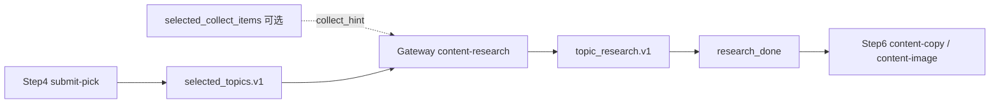

# content-research 角色（Step5）

> **产品 Step5**：读取 Step4 的 **`selected_topics.v1`**，经编排器 **`EXECUTE_STEP5_GENERATE_RESEARCH`** 调用本角色，产出 **`topic_research.v1`**。  
> **不是 Step4**：Slack `submit-pick` **只**写选题文件，不调用本角色。  
> 规则：`workspace-content-research/AGENTS.md` · 字段：`memo.md`

## 数据流（目标）

## 编排 vs 独立工具

| 方式 | 用途 |
|------|------|
| **`run-once` / dispatcher** | 主路径；`topics_selected` → Step5 |
| **`tools/content-research/run.mjs`** | 本地补跑、调试、`--force` 重试 |

二者均应写 `steps.research.output_ref` / `approve.research_ref`，并推进 `task.status` → **`research_done`**（目标）。

## 角色配置

- Workspace：`workspace-content-research/`
- Agent：`openclaw.json` → `content-research`（**无** Slack binding）

## 输入字段映射

| 来源 | 传给角色 |
|------|----------|
| `selected_topics.items[].title` | **主输入** |
| `topic_id` / `source_platform` / `source_url` | 上下文 |
| `selected_collect_items` 同行摘要 | 可选 `collect_hint` |

## 输出

`topic_research.v1` 每条 `items[]` 含 memo 格式 `research` 六数组，详见 `memo.md`。

## 与 Step5+ 的区别

- **Step5（本文）**：创作简报 `research`，**必走**主路径。
- **Step5+**：`enriched_research` 真实检索，**可选**，见 `memo.md`（未接编排）。
