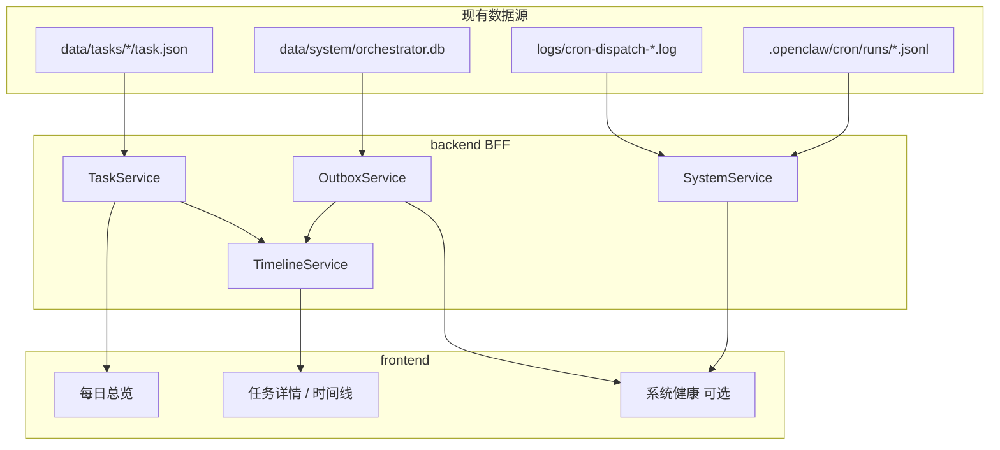

# 发布流水线 Web 仪表盘 — 总体设计

本文是 `publish-system/frontend` 与 `publish-system/backend` 的**方案级设计**，不涉及具体实现代码。  
规范真相仍以 `docs/00_basic_design/` 与 `node/src` 为准。

---

## 1. 目标

| 维度 | 说明 |
|------|------|
| **核心问题** | 每天任务走到哪一步？卡在哪？历史上某天完整流程是什么？ |
| **数据来源** | 只读聚合现有落盘数据，**不新建 SSOT** |
| **一期边界** | 只读展示 + 60s 轮询；人工操作仍走 Slack / CLI |
| **部署** | 默认本机 `localhost`；不暴露 auth、Gateway token |

---

## 2. 目录与职责

```text
publish-system/
  backend/          # Dashboard API（BFF）：读 task.json、outbox、日志，聚合 timeline
  frontend/       # Web UI：每日进度、流程时间线、产物摘要
  node/             # 现有编排器（不变）；backend 通过 import 或路径复用其模块
  docs/02_dashboard/
    tech-stack.md   # 技术选型定稿
    design.md       # 本文件
    api-contract.md # REST 契约（字段级）
    ui-pages.md     # 页面与组件规格
```

**与 `node/` 的关系：**

- `node/` 继续负责 Step1～7 执行、dispatcher、CLI
- `backend/` 是**独立进程**，启动时加载同一份 `config/publish.orchestrator.json`
- 复用点：`loadOrchestratorSettings`、`listTaskJsonPaths`、`loadTaskJson`、`OutboxRepo`（需扩展查询方法）

---

## 3. 数据流



---

## 4. 每日任务定位规则

1. **主键**：`task_id` 匹配 `daily-YYYYMMDD-*`（JST，与 `step1.task_id_date_format` 一致）
2. **兜底**：`created_at` 落在该 JST 日历日
3. **多 run**：同日前缀下按 `run_id` 排序，UI 默认展示 `r01`（或配置 `step1.default_run_id`）

---

## 5. 进度与流程记录定义

### 5.1 七步进度（UI 常量，与产品 Step 对齐）

| UI Step | `steps` 键 | 典型结束主状态 |
|---------|-----------|----------------|
| 1 创建 | — | `collecting` |
| 2 采集 | `collect` | `collected` |
| 3 整理 | `tidy` | `collected` |
| 4 选题 | `approval` / `approve` | `topics_selected` |
| 5 调研 | `research` | `research_done` |
| 6 生成 | `copy` + `image` | `image_generated` |
| 7 发布 | `publish` | `published` / `publish_partial_failed` |

每步 UI 状态取自 `steps.<key>.status`：`pending | running | success | failed | partial_failed | init_failed`。

**人工等待态**：`task.status === awaiting_manager_selection` 时，Step4 显示「等待 Slack 选题」，不算系统故障。

### 5.2 流程记录（Timeline）合并规则

按 `at` 时间升序，来源优先级与去重：

| 来源 | 字段 | 用途 |
|------|------|------|
| `task.json` → `history[]` | `at`, `event`, `operator`, `data` | **主时间线**（业务审计） |
| `steps.*` | `started_at`, `finished_at` | 补全步骤边界（若 history 未覆盖） |
| `outbox_events` | `created_at`, `event_type`, `revision` | 调度侧事件 |
| dispatch 日志 | 解析行 | 可选，运维调试 |

去重：同一 `revision` 的重复 `TASK_UPDATED` 可合并为一条。

---

## 6. 分阶段交付

| 阶段 | backend | frontend | 验收 |
|------|---------|----------|------|
| **P1 MVP** | health、days、task 详情、timeline | 今日卡片 + 7 步条 + 时间线列表 | 与 `task.json` history 一致 |
| **P2 运维** | outbox 查询、cron 状态、dispatch 日志摘要 | Outbox 告警条、历史日期切换 | 能看到 failed 事件与 cron 失败 |
| **P3 产物** | artifacts 摘要 API、图片静态路径 | 选题/文案/发布结果预览 | 只读预览产物 JSON |
| **P4 操作** | submit-pick / retry-step7（鉴权） | Web 内操作按钮 | 可选，非一期 |

---

## 7. 安全与配置

- 配置：仅读 `publish.orchestrator.json` 的 `paths.*`、`timezone`
- 产物路径：服务端校验必须在 `tasks_dir` 下，禁止 `..` 穿越
- 不 serve：`data/auth/`、`.openclaw/credentials/`、agent sessions 全文
- CORS：开发期允许 `frontend` dev server origin；生产同源或内网

---

## 8. 相关文档

- [技术选型定稿](./tech-stack.md)
- [API 契约](./api-contract.md)
- [UI 页面规格](./ui-pages.md)
- [backend/README.md](../../backend/README.md)
- [frontend/README.md](../../frontend/README.md)
