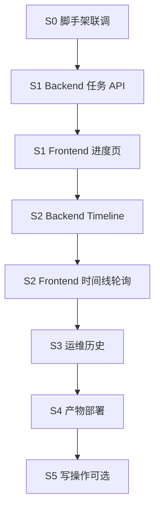

# Dashboard 开发方案与顺序

本文定义 **从 0 到可用** 的实施步骤、前后端协作顺序、验收标准与风险。  
技术栈见 [tech-stack.md](./tech-stack.md)，API 见 [api-contract.md](./api-contract.md)，UI 见 [ui-pages.md](./ui-pages.md)。

---

## 1. 原则

| 原则 | 说明 |
|------|------|
| **后端先行一步** | 每个 UI 功能对接前，对应 API 先可用 |
| **垂直切片** | 按「用户可见功能」切里程碑，而非「先写完所有 API」 |
| **只读优先** | P1～P3 不写 `task.json` / outbox；人工操作仍走 Slack |
| **复用 node/** | 不复制 task 加载逻辑；Outbox 查询在 `OutboxRepo` 扩展 |
| **可演示即验收** | 每阶段有可截图/可演示的页面 |

---

## 2. 阶段总览

```text
S0  脚手架 + 联调打通          （约 0.5～1 天）
S1  MVP：今日进度 + 任务详情   （约 2～3 天）
S2  时间线 + 轮询稳定          （约 1～2 天）
S3  运维：Outbox / Cron / 历史  （约 2 天）
S4  产物预览 + 单进程部署       （约 2 天）
S5  写操作（可选）              （按需）
```

---

## 3. 详细顺序

### S0 — 脚手架与联调（第 1 步，前后端可并行）

**目标**：双进程跑起来，`GET /api/health` 在浏览器可调通。

#### Backend

| 序号 | 任务 | 产出 |
|------|------|------|
| S0-B1 | `package.json`、`tsconfig.json`（paths 指向 `../node/src`） | 可 `npm run dev` |
| S0-B2 | Hono 入口：logger、cors、secureHeaders、errorHandler、notFound | `src/index.ts` |
| S0-B3 | `dashboardConfig.ts`：端口、OPENCLAW_ROOT、配置路径 | 环境变量可读 |
| S0-B4 | 加载 `publishOrchestratorConfig`，校验 paths 可达 | 启动时自检 |
| S0-B5 | `GET /api/health` | 返回 ok、paths、server_time |

#### Frontend

| 序号 | 任务 | 产出 |
|------|------|------|
| S0-F1 | Vite + React + TS + Tailwind 初始化 | 可 `npm run dev` |
| S0-F2 | `vite.config.ts` proxy `/api` → `:8787` | 无 CORS 问题 |
| S0-F3 | React Router 空壳：`/`、`/task/:taskId` | 路由可切换 |
| S0-F4 | TanStack Query Provider + `api/client.ts` | 可调 health |
| S0-F5 | 首页临时显示 health JSON 或「服务正常」 | 联调验收 |

**验收**：浏览器打开 `localhost:5173`，显示 backend health 成功。

---

### S1 — MVP：每日总览 + 任务详情（核心价值）

**目标**：看到今天 `daily-YYYYMMDD-r01` 的 7 步进度和主状态。

#### Backend（先做）

| 序号 | 任务 | 产出 |
|------|------|------|
| S1-B1 | `utils/dateJst.ts`：`YYYYMMDD` ↔ JST 日界 | 日期工具 |
| S1-B2 | `TaskService`：`listAll`、`getById`、`getPrimaryForDate` | 读 task.json |
| S1-B3 | `TaskService` → DTO：`toTaskSummary()`（含 steps、progress 计算） | 对齐 api-contract |
| S1-B4 | `GET /api/tasks/:taskId`（Zod 校验 taskId） | 单任务详情 |
| S1-B5 | `GET /api/days?from=&to=` | 日历摘要列表 |

#### Frontend（API 就绪后）

| 序号 | 任务 | 产出 |
|------|------|------|
| S1-F1 | `types/task.ts` 对齐 DTO | TS 类型 |
| S1-F2 | `useTaskDetail`、`useDailyTask` hooks | Query 封装 |
| S1-F3 | `StepProgressBar`（7 步，含 Step6 copy+image 合并规则） | 核心组件 |
| S1-F4 | `TaskStatusBadge`、`DailyTaskCard` | 状态展示 |
| S1-F5 | `DailyOverviewPage`：默认今天 JST，无任务 EmptyState | 首页 |
| S1-F6 | `TaskDetailPage` 骨架：summary + steps 表格 | 详情页 |
| S1-F7 | `HumanGateAlert`：`awaiting_manager_selection` 提示 | 人工卡点 |

**验收**：

- 有当日任务时，首页显示 7 步进度与 `task.status`
- 点击详情可见各 step 的 status / 时间 / output_ref
- 无任务时显示「等待 09:00 创建」类提示

**测试数据**：若无真实任务，手动 `npm run orchestrator -- create-task` 或复制 fixture `task.json` 到 `data/tasks/`。

---

### S2 — 流程时间线 + 轮询

**目标**：任务详情页展示完整流程记录，页面自动刷新。

#### Backend

| 序号 | 任务 | 产出 |
|------|------|------|
| S2-B1 | `TimelineService`：合并 `history[]` + step 边界 +（可选）outbox | 时间线逻辑 |
| S2-B2 | `GET /api/tasks/:taskId/timeline` | API |
| S2-B3 | （可选）`OutboxRepo.listByTaskId` 扩展于 `node/` | 只读 SQL |

#### Frontend

| 序号 | 任务 | 产出 |
|------|------|------|
| S2-F1 | `EventTimeline` + `TimelineItem`（kind 分样式） | 时间线 UI |
| S2-F2 | 详情页接入 timeline | 主栏时间线 |
| S2-F3 | Query `refetchInterval: 60_000` | 60s 轮询 |
| S2-F4 | `ErrorBanner`、Skeleton、`上次更新` 时间 | 体验完善 |
| S2-F5 | `formatJst.ts` 统一时间展示 | JST 格式 |

**验收**：

- 时间线条目与 `task.json` 的 `history[]` 一致（顺序、事件名）
- 等待 60s 或 orchestrator 推进一步后，页面自动更新

---

### S3 — 运维与历史日期

**目标**：排查 outbox 积压、cron 是否正常；切换历史日期。

#### Backend

| 序号 | 任务 | 产出 |
|------|------|------|
| S3-B1 | `OutboxService.listByFilter` + `GET /api/outbox` | 队列查询 |
| S3-B2 | `SystemService.readCronJobs` + `GET /api/system/cron` | cron 状态 |
| S3-B3 | `SystemService.parseDispatchLog` + `GET /api/system/dispatch-log?date=` | dispatch 摘要 |

#### Frontend

| 序号 | 任务 | 产出 |
|------|------|------|
| S3-F1 | `DatePicker` / 日期切换 → `/day/:date` | 历史导航 |
| S3-F2 | `SystemPage`：`OutboxQueueTable`、`CronJobsTable` | 运维页 |
| S3-F3 | 首页 `SystemHealthBar`（pending/failed 计数） | 告警条 |
| S3-F4 | 路由 `/system` | 完整导航 |

**验收**：

- 可查看非今日任务（若 `data/tasks/` 有历史 `daily-*`）
- `/system` 能看到 outbox failed 与 cron 最近执行结果

---

### S4 — 产物预览 + 生产形态

**目标**：选题/文案/发布结果可读；本机单端口访问。

#### Backend

| 序号 | 任务 | 产出 |
|------|------|------|
| S4-B1 | `utils/pathGuard.ts`：禁止 `..` 穿越 | 安全 |
| S4-B2 | `ArtifactService.summarize(step)` + `GET /api/tasks/:id/artifacts/:step` | 产物摘要 |
| S4-B3 | `GET /api/tasks/:id/files/*` 或专用静态路由 | 图片预览 |
| S4-B4 | 生产模式：`serveStatic(../frontend/dist)` + 同端口 | 单进程 8787 |

#### Frontend

| 序号 | 任务 | 产出 |
|------|------|------|
| S4-F1 | 详情页 `StepDetailTabs`：按 step 懒加载 artifact | Tab 预览 |
| S4-F2 | 选题列表、发布平台结果表 | 摘要 UI |
| S4-F3 | 图片缩略图（`/files/...`） | P3 预览 |
| S4-F4 | `npm run build` + backend 托管验证 | 生产路径 |

**验收**：

- Step4 选题、Step7 发布结果可在 Web 内阅读（不必开 JSON 文件）
- 仅开 backend 一个进程即可访问完整 UI（`:8787`）

---

### S5 — 写操作（**后期备选，当前不做**）

> **决策（2026-06）**：S0～S4 已满足日常只读监控需求；S5 暂不实施，人工操作继续走 **Slack / CLI**。

| 序号 | 任务 | 说明 |
|------|------|------|
| S5-B1 | Bearer auth 中间件 | `DASHBOARD_TOKEN` |
| S5-B2 | `POST /api/tasks/:id/submit-pick` | 封装 CLI 逻辑 |
| S5-B3 | `POST /api/tasks/:id/retry-step7` | 封装 retry |
| S5-F1 | 详情页操作按钮 + 确认对话框 | Web 内选题/重试 |

**触发条件（任一满足再考虑 S5）**：内网多人使用且不愿开 Slack；需要审计 Web 内操作；移动端/非 Slack 环境运维。

---

## 3.1 当前交付范围（已定稿）

| 阶段 | 状态 | 能力 |
|------|------|------|
| S0 | ✅ | 脚手架、health 联调 |
| S1 | ✅ | 每日进度、任务详情 |
| S2 | ✅ | 流程时间线、60s 轮询 |
| S3 | ✅ | Outbox / Cron / 历史日期、运维页 |
| S4 | ✅ | 产物预览、单端口 `:8787` |
| S5 | ⏸ 备选 | Web 内 submit-pick / retry-step7 |

**日常入口**：`http://127.0.0.1:8787`（`frontend npm run build` + `backend npm start`）。

---

## 4. 前后端协作节奏（推荐甘特）

```text
Week 1
  Day 1     S0 前后端脚手架 + health 联调
  Day 2-3   S1-B 全部 → S1-F StepProgressBar + 首页
  Day 4     S1-F 详情页 + S2-B timeline API
  Day 5     S2-F 时间线 + 轮询

Week 2
  Day 1-2   S3 运维 + 历史日期
  Day 3-4   S4 产物 + 单进程部署
  Day 5     缓冲：bugfix、文档、真实任务 E2E 走一遍
```

若单人开发：**严格按 S0 → S1-B → S1-F → S2 → … 顺序**，不要跳步。

---

## 5. 依赖关系图



**node/ 侧需配合的改动**（非阻塞 S1，S2/S3 前完成即可）：

- `OutboxRepo.listByFilter()` / `listByTaskId()`

---

## 6. 每阶段自检清单

### 开发环境

- [ ] `publish-system/config/publish.orchestrator.json` 存在且 `npm run config:check`（node）通过
- [ ] `data/tasks/` 至少有一条测试任务，或能 create-task
- [ ] backend `:8787`、frontend `:5173` 同时运行

### S1 完成后

- [ ] `curl http://127.0.0.1:8787/api/health` 返回 ok
- [ ] `curl http://127.0.0.1:8787/api/tasks/daily-YYYYMMDD-r01` 返回 steps
- [ ] 首页 7 步条与 `task.json` 的 `steps.*.status` 一致

### S2 完成后

- [ ] timeline 条数 ≥ `history.length`（含 step 边界补全）
- [ ] 改 task.json 后 60s 内 UI 更新

### S4 完成后

- [ ] `frontend npm run build` + 仅 backend 进程可访问完整站
- [ ] 访问 `data/auth/` 路径返回 403/404

---

## 7. 风险与对策

| 风险 | 对策 |
|------|------|
| `data/tasks/` 为空 | S0 后准备 fixture 或跑 `create-task` |
| backend import `node/` 路径/tsconfig 报错 | S0 专门留时间配 paths + 跑 typecheck |
| `history[]` 与 outbox 重复 | TimelineService 按 revision 去重 |
| Windows 路径 | 全程 `path.resolve`，与 orchestrator 一致 |
| task 状态枚举演进 | DTO 层映射，前端不硬编码全量 enum |

---

## 8. 建议的第一周「最小路径」

若时间紧，**只做以下 8 步即可交付可用 MVP**：

1. S0-B + S0-F：health 联调  
2. S1-B2～B4：`TaskService` + `GET /tasks/:id`  
3. S1-B5：`GET /days`  
4. S1-F2～F5：Query + 进度条 + 首页  
5. S1-F6～F7：详情页 + 人工等待提示  
6. S2-B1～B2：timeline API  
7. S2-F1～F3：时间线 + 60s 轮询  
8. 用真实 `daily-*` 任务走一遍 E2E  

S3、S4 可第二个迭代再做。

---

## 9. 相关文档

- [tech-stack.md](./tech-stack.md)
- [api-contract.md](./api-contract.md)
- [ui-pages.md](./ui-pages.md)
- [design.md](./design.md)
