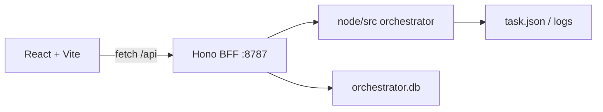

# Dashboard 技术选型（定稿）

本文记录 `frontend/` 与 `backend/` 的**已定稿**技术栈，实现时以此为准。

---

## 1. 总览

| 层 | 定稿选型 |
|----|----------|
| **前端** | Vite + React 19 + TypeScript + React Router 7 + TanStack Query v5 + Tailwind CSS 4 |
| **后端** | Node.js ≥20 + TypeScript + Hono + Zod + tsx |
| **中间件** | CORS → Logger → SecureHeaders → Zod 校验 → 路由 → 统一错误处理 |
| **数据** | 复用 `node/` 的 taskStore / OutboxRepo；SQLite 只读（`node:sqlite`） |
| **部署（本机）** | Hono 单进程：`/api/*` + 可选 `serveStatic(frontend/dist)`，端口 **8787** |

---

## 2. 前端

| 类别 | 选型 | 说明 |
|------|------|------|
| 构建 | **Vite** 6.x | dev server + 生产打包 |
| 语言 | **TypeScript** 5.8+ | 与 `node/` 对齐 |
| UI 框架 | **React** 19 | |
| 路由 | **React Router** 7.x | `/`、`/day/:date`、`/task/:id`、`/system` |
| 数据请求 | **TanStack Query** v5 | 60s 轮询、缓存、重试 |
| HTTP | **fetch** | 由 Query hooks 封装 |
| 样式 | **Tailwind CSS** 4.x | `@tailwindcss/vite` |
| 基础 UI | **shadcn/ui**（可选） | 仅 Table、Badge、Alert、Skeleton |
| 日期 | **date-fns** + **date-fns-tz** | JST 展示 |

### 开发联调

```text
frontend  Vite :5173
  proxy /api  →  http://127.0.0.1:8787
  proxy /files → backend 静态产物路由（P3）
```

### 依赖（实现时）

```text
react react-dom
react-router-dom
@tanstack/react-query
date-fns date-fns-tz
tailwindcss @tailwindcss/vite
typescript vite @vitejs/plugin-react
```

shadcn 可选：`class-variance-authority clsx tailwind-merge lucide-react`

### 不做

- Next.js / SSR
- Redux
- 浏览器直读 `data/tasks/` 或 SQLite
- Ant Design / MUI 等重型 UI 库

---

## 3. 后端

| 类别 | 选型 | 说明 |
|------|------|------|
| 运行时 | **Node.js** ≥20 | 与 orchestrator 一致 |
| 语言 | **TypeScript** | `strict: true`，ESM `"type": "module"` |
| 开发运行 | **tsx watch** | 与 `node/` 相同 |
| HTTP 框架 | **Hono** | 轻量 REST API |
| Node 适配 | **@hono/node-server** | 本地 HTTP |
| 校验 | **Zod** + **@hono/zod-validator** | query / path / body、DTO |
| 配置 | **`publishOrchestratorConfig`** | `../config/publish.orchestrator.json` |
| SQLite | **node:sqlite**（`DatabaseSync`） | 扩展 `OutboxRepo` 只读查询 |
| 日志 | **pino**（或初期 console） | 结构化请求日志 |

### 中间件顺序

```text
1. logger           @hono/logger 或 pino
2. cors             @hono/cors（dev 允许 http://localhost:5173）
3. secureHeaders    @hono/secure-headers
4. zodValidator     @hono/zod-validator（按路由）
5. routes           /api/*
6. errorHandler     统一 { error: { code, message } }
7. notFound         404 JSON

P4 写操作再加：Bearer auth middleware
P3 产物预览：hono serveStatic（pathGuard 校验 tasks_dir 内）
```

| 中间件 | 包 | 阶段 |
|--------|-----|------|
| CORS | `@hono/cors` | P1 |
| 请求日志 | `@hono/logger` | P1 |
| 安全头 | `@hono/secure-headers` | P1 |
| 参数校验 | `@hono/zod-validator` + `zod` | P1 |
| 压缩 | `@hono/compress` | 可选 |
| 限流 | `@hono/rate-limit` | 公网才需要 |
| 鉴权 | 自写 Bearer | P4 |
| 静态文件 | `hono serveStatic` | P3 / 生产托管 frontend |

### 依赖（实现时）

```text
hono @hono/node-server
@hono/cors @hono/logger @hono/secure-headers
@hono/zod-validator zod
tsx typescript @types/node
pino（可选）
```

### 与 `node/` 代码复用

**一期**：backend 相对 import `../node/src/orchestrator/...`（`taskStore`、`OutboxRepo`、`publishOrchestratorConfig`）。

**后期**：抽 `publish-system/shared/` 公共包。

---

## 4. 生产部署（本机）

**推荐：Hono 单进程**

```text
http://localhost:8787
  /api/*     → BFF
  /*         → frontend/dist（serveStatic）
```

开发期：frontend、backend 双进程（Vite + tsx watch）。

---

## 5. 架构图



---

## 6. 相关文档

- [design.md](./design.md)
- [api-contract.md](./api-contract.md)
- [ui-pages.md](./ui-pages.md)
- [backend/README.md](../../backend/README.md)
- [frontend/README.md](../../frontend/README.md)
